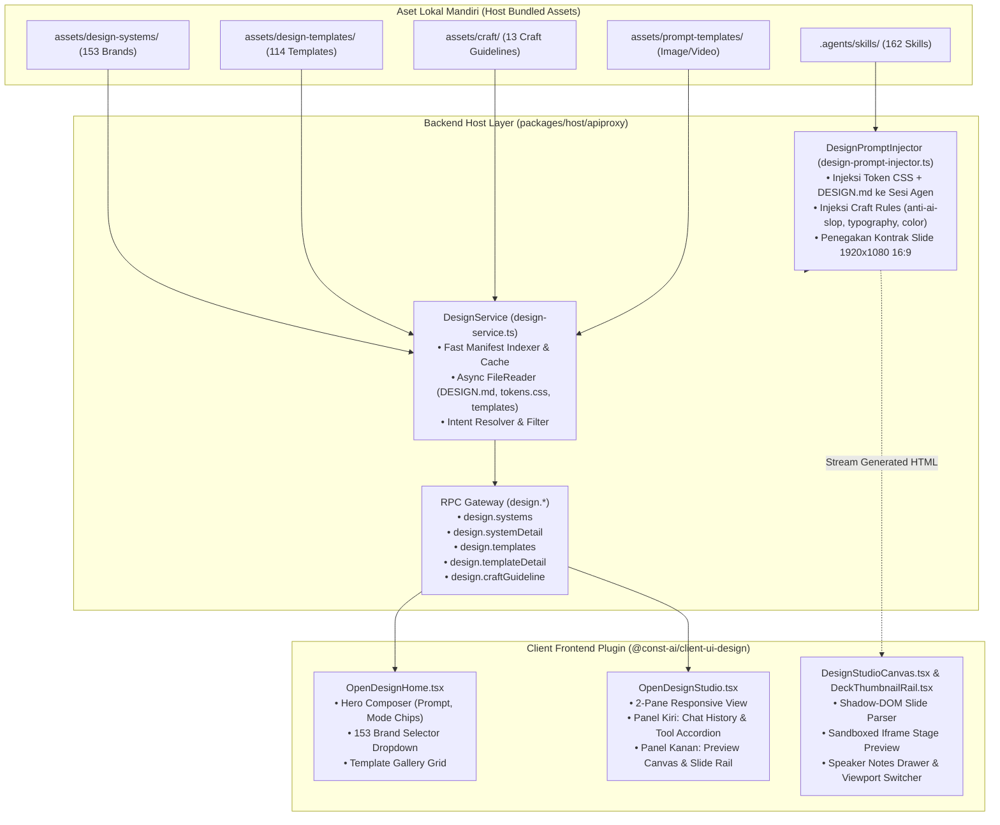

# OpenDesign Native Master Implementation Plan for Const-Harness

Dokumen ini adalah cetak biru teknis (*technical blueprint*) dan panduan eksekusi bertahap (*modular & granular*) untuk mengintegrasikan **OpenDesign** secara **native** ke dalam ekosistem **Const-Harness**, menggantikan arsitektur lama berbasis wrapping CLI eksternal.

Dokumen ini disimpan di root repositori untuk menjaga kontinuitas pengerjaan across sessions/chats tanpa kehilangan detail arsitektur, inventaris data, maupun panduan implementasi.

---

## 1. Inventaris Lengkap Aset OpenDesign (`D:\Code\Clone\open-design`)

Seluruh dataset dan aset telah diaudit secara lengkap dari repositori sumber `D:\Code\Clone\open-design`:

| Dataset / Direktori Sumber | Jumlah & Ukuran | Kandungan Teknis & Peran | Lokasi Penempatan di Const-Harness |
| :--- | :--- | :--- | :--- |
| **`design-systems/`** | **153 Brand** (~32.4 MB, 4.040 files) | • `manifest.json`: Metadata brand, kategori, tag, craft suggestions, preview pages.<br>• `DESIGN.md` & `DESIGN-[lang].md`: Aturan prinsip desain, tipografi, warna, dan komponen.<br>• `tokens.css`: Token CSS `:root` (--bg, --fg, --accent, --font-*, --radius, --shadow, dll.).<br>• `design-tokens.json`: Representasi token dalam format JSON.<br>• `components.html`: Snippet HTML komponen siap pakai (tombol, card, badge, tab, form, tabel).<br>• `tailwind-v4.css`: Konfigurasi theme Tailwind v4.<br>• `preview/*.html`: Halaman preview warna, tipografi, dan spacing. | `packages/host/apiproxy/assets/design-systems/` |
| **`design-templates/`** | **114 Template** (~38.0 MB, 747 files) | • Starter layout HTML, struktur slide deck interaktif (`html-ppt-pitch-deck`, `html-ppt-course-module`, `html-ppt-product-launch`, dll.).<br>• Template prototipe web (`live-dashboard`, `web-prototype`, `hyperframes`, `social-carousel`, `invoice`, `pricing-page`, `kanban-board`, dll.). | `packages/host/apiproxy/assets/design-templates/` |
| **`craft/`** | **13 Dokumen** (~120 KB) | Panduan standar kualitas desain (*craft rules*):<br>• `anti-ai-slop.md`: Aturan pencegahan visual klise AI (hindari gradien ungu-biru, kartu kaca generik, rounded berlebihan).<br>• `typography.md`, `typography-hierarchy.md`, `typography-hierarchy-editorial.md`: Standar hierarki tipografi.<br>• `color.md`: Harmoni dan kontras warna.<br>• `accessibility-baseline.md`: Standar WCAG & a11y.<br>• `animation-discipline.md`: Standar transisi & motion performant.<br>• `form-validation.md`, `laws-of-ux.md`, `rtl-and-bidi.md`, `state-coverage.md`. | `packages/host/apiproxy/assets/craft/` |
| **`skills/`** | **162 Skill** (~3.1 MB, 356 files) | Skill keahlian agen:<br>• `slides`: Pembuatan presentasi PPTX via PptxGenJS.<br>• `deck-open-slide-canvas`: Spesifikasi canvas slide 1920×1080 16:9, responsive CSS scale transform, 1 fokus visual per slide, speaker notes.<br>• `frontend-design`: Standar pembuatan UI produksi bermutu tinggi.<br>• `taste-skill` / `gpt-tasteskill` / `creative-director` / `brand-guidelines` / `color-expert` / `canvas-design` / `artifacts-builder` / dll. | `.agents/skills/` |
| **`prompt-templates/`** | **2 Folder** (image, video) | Template prompt untuk pembuatan aset gambar & video terstruktur. | `packages/host/apiproxy/assets/prompt-templates/` |

---

## 2. Diagram Arsitektur Integrasi Native



---

## 3. Rencana Eksekusi Bertahap (Detailed Modular Phases)

### 📦 FASE 1: Backend Foundation (Pondasi Data & Host RPC)
*Fokus: Membangun layer data, RPC contracts, validation schemas, loader service, dan automated tests tanpa menyentuh UI terlebih dahulu.*

#### **Sub-Fase 1A: Ingesti & Penataan Aset Data**
1. Buat direktori aset internal:
   - `packages/host/apiproxy/assets/design-systems/` (salin 153 folder brand lengkap).
   - `packages/host/apiproxy/assets/design-templates/` (salin 114 folder template lengkap).
   - `packages/host/apiproxy/assets/craft/` (salin 13 dokumen craft).
   - `packages/host/apiproxy/assets/prompt-templates/` (salin prompt image/video).
2. Salin 162 skill OpenDesign ke direktori `.agents/skills/`.

#### **Sub-Fase 1B: Kontrak Tipe & Skema Validasi Zod**
1. Buat file `packages/host/apiproxy/src/api/design.ts`:
   - `DesignSystemSummary` (id, name, category, description, tags, suggestedCraft, previewColors).
   - `DesignSystemDetail` (manifest, content `DESIGN.md`, content `tokens.css`, `designTokens` JSON, `components.html`).
   - `DesignTemplateSummary` (id, title, category, description, tags, previewPath).
   - `DesignTemplateDetail` (starter HTML, slide structures, config).
   - `CraftGuideline` (id, title, content markdown).
   - Interface `DesignApi` (unary method signatures).
2. Buat file `packages/host/apiproxy/src/api/design.schema.ts`:
   - Validasi Zod untuk seluruh request payload dan response value domain `design.*`.
3. Daftarkan di `packages/host/apiproxy/src/api/rpc-map.ts` dan `packages/host/apiproxy/src/api/rpc.schema.ts`.

#### **Sub-Fase 1C: Implementasi `DesignService` & Host RPC Binding**
1. Buat `packages/host/apiproxy/src/design-service.ts`:
   - In-memory indexing saat inisialisasi agar pemanggilan daftar 153 brand dan 114 template berlangsung instan ($<1$ms).
   - Method async untuk membaca file detail (`DESIGN.md`, `tokens.css`, dll.) secara efisien on-demand.
   - Method `craftGuideline(id)` untuk mengambil panduan craft spesifik.
2. Hubungkan `DesignService` ke dalam instance `ApiProxy` di `packages/host/apiproxy/src/api-proxy.ts`.

#### **Sub-Fase 1D: Pengujian Otomatis & Verifikasi Backend**
1. Buat file unit test `packages/host/apiproxy/tests/design-service.spec.ts`.
2. Jalankan `pnpm --filter @const-ai/host-apiproxy run test` dan `pnpm run typecheck`.
3. Pastikan 100% test pass dan seluruh skema tervalidasi.

---

### 🧠 FASE 2: Agent Design Brain (Prompt Engine & Skill Activation)
*Fokus: Memastikan agen native Const mampu memproduksi file HTML Slide Deck & Prototype yang indah, sesuai standar tema yang dipilih, dan bebas dari AI slop.*

#### **Sub-Fase 2A: Design Prompt Engine**
1. Buat `packages/host/apiproxy/src/design-prompt-injector.ts`:
   - Helper yang menyusun system prompt desain saat sesi OpenDesign dibuat:
     - Injeksi token CSS (`:root { ... }`) dari design system yang dipilih ke header `<style>`.
     - Injeksi pedoman `DESIGN.md` dan aturan craft yang relevan (`anti-ai-slop`, `typography`, `color`).
     - Injeksi spesifikasi slide deck: rasio 16:9, `<section class="slide" data-slide-id="...">`, responsive CSS scale transform, 1 visual weight per slide, drawer speaker notes.
2. Hubungkan prompt injector ke lifecycle pembuatan sesi di host.

#### **Sub-Fase 2B: Pengujian Injeksi Prompt & Output Agen**
1. Uji unit prompt injector untuk memastikan payload prompt terformat rapi dan sesuai batas token.

---

### 🎨 FASE 3: Frontend Plugin Shell & Home View (Dipandu User Bertahap)
*Fokus: Membangun antarmuka landing page saat user mengklik menu "Design" di sidebar.*

#### **Sub-Fase 3A: Paket Client Plugin `@const-ai/client-ui-design`**
1. Inisialisasi paket di `packages/client/ui-design/`:
   - `package.json`, `tsconfig.json`, `tsdown.config.ts`.
   - Entry point Node (`src/index.ts`) dan Browser (`src/client/index.ts`).
   - Pendaftaran slot navigasi sidebar (`sidebar.footer.action` / `shell.overlay` dengan action `const:open-design`).

#### **Sub-Fase 3B: Komponen `OpenDesignHome.tsx`**
1. **Hero Composer**:
   - Input prompt multiline dengan chips mode (`# Prototype`, `Slide deck`, `Document`, `HyperFrames`, `Website clone`).
   - Dropdown Brand Design System (memanggil RPC `design.systems`, menampilkan 153 brand dengan warna aksen & preview).
   - Dropdown Working Directory dan status agen.
2. **Template Gallery**:
   - Filter kategori (*All, Fundraising pitch, Corporate strategy, B2B sales, Product management*).
   - Grid kartu template interaktif yang otomatis mengisi prompt ketika diklik.
3. Tombol Kirim / Run yang memicu pembuatan sesi native di `const-harness`.

---

### 🖥️ FASE 4: Studio 2-Pane View & Interactive Canvas (Dipandu User Bertahap)
*Fokus: Membangun antarmuka dua kolom interaktif saat proses pembuatan/editing desain berlangsung.*

#### **Sub-Fase 4A: Komponen `OpenDesignStudio.tsx` (2-Kolom)**
1. **Kolom Kiri (Turn History & Tools)**:
   - Menampilkan riwayat percakapan agen, indikator status berpikir (*thinking*), accordion tool call `Search/Read/Write`, daftar deliverables badge `.html`, dan checklist todos.
   - Chat composer di bagian bawah untuk prompt revisi lanjutan.

#### **Sub-Fase 4B: Komponen `DesignStudioCanvas.tsx` & `DeckThumbnailRail.tsx`**
1. **Rel Thumbnail Slide (Kiri Stage)**:
   - Parser Shadow-DOM ringan (`deck-parser.ts`) untuk mengekstrak slide 1..N menjadi thumbnail interaktif tanpa membebani browser.
2. **Stage Preview (Tengah Stage)**:
   - Container iframe preview interaktif dengan isolasi sandbox yang aman.
3. **Drawer Speaker Notes**:
   - Catatan pembicara di bagian bawah stage preview.
4. **Toolbar Studio**:
   - Switcher Viewport (`Desktop`, `Tablet`, `Mobile`), Toggle `Preview` vs `Code`, tombol Presentation fullscreen.

---

### 🚀 FASE 5: Export Engine & Fitur Lanjutan (Dipandu User Bertahap)
*Fokus: Fitur ekspor hasil dan alat bantu anotasi visual.*

#### **Sub-Fase 5A: Modal Ekspor (`DesignExportModal.tsx`)**
1. Ekspor file HTML standalone mandiri (seluruh CSS/font/SVG ter-embed).
2. Render PDF print preview.
3. Ekspor PPTX presentation.

#### **Sub-Fase 5B: Layer Anotasi Visual (`PreviewDrawOverlay.tsx`)**
1. Tool coret-coret / pen drawing di atas canvas preview untuk memberikan feedback visual langsung kepada agen.

#### **Sub-Fase 5C: Polishing & Localization**
1. Dukungan multi-bahasa (`en`, `zh`, `id`) pada kamus UI.
2. Optimasi animasi dan transisi UI.

---

## 4. Checklist Struktur File di Const-Harness

```text
packages/
├── host/apiproxy/
│   ├── assets/
│   │   ├── design-systems/          # [1A] 153 brand folders (DESIGN.md, tokens.css, components.html, dll.)
│   │   ├── design-templates/        # [1A] 114 template folders (starter HTML & layouts)
│   │   ├── craft/                   # [1A] 13 craft guidelines markdown
│   │   └── prompt-templates/        # [1A] Image & video prompt blueprints
│   ├── src/
│   │   ├── api/
│   │   │   ├── design.ts            # [1B] Interface & RPC method map
│   │   │   └── design.schema.ts     # [1B] Zod validation schema
│   │   ├── design-service.ts        # [1C] In-memory indexer & async file loader
│   │   └── design-prompt-injector.ts# [2A] Agent prompt & CSS token injector
│   └── tests/
│       └── design-service.spec.ts   # [1D] Backend unit tests
│
└── client/ui-design/
    ├── package.json                 # [3A] Plugin manifest
    ├── tsconfig.json                # [3A] Client TSConfig
    ├── tsdown.config.ts             # [3A] Bundle config
    └── src/
        ├── index.ts                 # [3A] Node apply entry
        ├── invariant.ts             # [3A] Invariant companion
        └── client/
            ├── index.ts             # [3A] Cordis slots registration (sidebar.footer.action / shell.overlay)
            ├── DesignRoot.tsx       # [3A] Router view (Home <-> Studio)
            ├── OpenDesignHome.tsx   # [3B] Home view (Hero Composer, Gallery)
            ├── OpenDesignHome.module.css
            ├── OpenDesignStudio.tsx # [4A] Studio 2-pane view
            ├── OpenDesignStudio.module.css
            ├── DesignStudioCanvas.tsx # [4B] Iframe stage & toolbar
            ├── DeckThumbnailRail.tsx  # [4B] Slide deck thumbnail rail
            ├── deck-parser.ts       # [4B] Shadow-DOM slide parser
            ├── PreviewDrawOverlay.tsx # [5B] Visual annotation layer
            └── DesignExportModal.tsx  # [5A] Export dialog
```

---

## 5. Status Progres & Log Eksekusi

| Fase / Sub-Fase | Deskripsi | Status | Catatan / Hasil Verifikasi |
| :--- | :--- | :---: | :--- |
| **Sub-Fase 1A** | Ingesti Aset (153 systems, 114 templates, 13 craft docs, 162 skills) | ✅ Completed | 153 brands, 114 templates, 13 craft docs, 2 prompt templates & 162 skills sukses disalin & diverifikasi. |
| **Sub-Fase 1B** | Kontrak Tipe RPC & Zod Schemas (`design.ts`, `design.schema.ts`) | ⏳ Pending | Terhubung ke `rpc-map.ts` & `rpc.schema.ts` |
| **Sub-Fase 1C** | Implementasi `DesignService` & Binding Host | ⏳ Pending | Pemuatan cepat $<1$ms in-memory cache |
| **Sub-Fase 1D** | Unit Tests & Backend Verification | ⏳ Pending | Target 100% vitest pass |
| **Fase 2** | Agent Design Brain & Prompt Engine | ⏳ Pending | Prompt injector & craft rules injection |
| **Fase 3** | Client Plugin Shell & Home View | ⏳ Pending | Dipandu user bertahap |
| **Fase 4** | Studio 2-Pane View & Interactive Canvas | ⏳ Pending | Dipandu user bertahap |
| **Fase 5** | Export Engine, Drawing Layer & Polish | ⏳ Pending | Dipandu user bertahap |