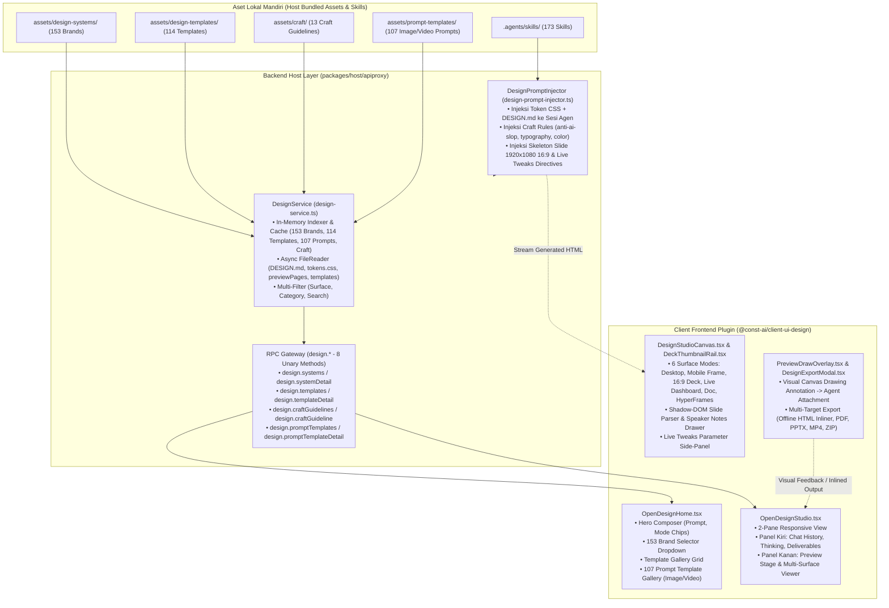

# OpenDesign Native Master Implementation Plan for Const-Harness

Dokumen ini adalah cetak biru teknis (*technical blueprint*) dan panduan eksekusi bertahap (*modular & granular*) untuk mengintegrasikan **OpenDesign** secara **native** ke dalam ekosistem **Const-Harness**, menggantikan arsitektur lama berbasis wrapping CLI eksternal.

Dokumen ini disimpan di root repositori untuk menjaga kontinuitas pengerjaan across sessions/chats tanpa kehilangan detail arsitektur, inventaris data, maupun panduan implementasi.

---

## 1. Inventaris Lengkap Aset OpenDesign (`D:\Code\Clone\open-design`)

Seluruh dataset dan aset telah diaudit dan disinkronisasi secara lengkap dari repositori sumber `D:\Code\Clone\open-design`:

| Dataset / Direktori Sumber | Jumlah & Ukuran | Kandungan Teknis & Peran | Lokasi Penempatan di Const-Harness |
| :--- | :--- | :--- | :--- |
| **`design-systems/`** | **153 Brand** (~32.4 MB, 4.040 files) | • `manifest.json`: Metadata brand, kategori, tag, craft suggestions, preview pages.<br>• `DESIGN.md` & `DESIGN-[lang].md`: Aturan prinsip desain, tipografi, warna, dan komponen.<br>• `tokens.css`: Token CSS `:root` (--bg, --fg, --accent, --font-*, --radius, --shadow, dll.).<br>• `design-tokens.json`: Representasi token dalam format JSON.<br>• `components.html`: Snippet HTML komponen siap pakai (tombol, card, badge, tab, form, tabel).<br>• `tailwind-v4.css`: Konfigurasi theme Tailwind v4.<br>• `preview/*.html`: Halaman preview warna, tipografi, spacing, dan komponen. | `packages/host/apiproxy/assets/design-systems/` |
| **`design-templates/`** | **114 Template** (~38.0 MB, 747 files) | • Starter layout HTML, struktur slide deck interaktif (`html-ppt-pitch-deck`, `html-ppt-course-module`, `html-ppt-product-launch`, dll.).<br>• Template prototipe web (`live-dashboard`, `web-prototype`, `hyperframes`, `social-carousel`, `invoice`, `pricing-page`, `kanban-board`, dll.). | `packages/host/apiproxy/assets/design-templates/` |
| **`craft/`** | **13 Dokumen** (~120 KB) | Panduan standar kualitas desain (*craft rules*):<br>• `anti-ai-slop.md`: Aturan pencegahan visual klise AI (hindari gradien ungu-biru, kartu kaca generik, rounded berlebihan).<br>• `typography.md`, `typography-hierarchy.md`, `typography-hierarchy-editorial.md`: Standar hierarki tipografi.<br>• `color.md`: Harmoni dan kontras warna.<br>• `accessibility-baseline.md`: Standar WCAG & a11y.<br>• `animation-discipline.md`: Standar transisi & motion performant.<br>• `form-validation.md`, `laws-of-ux.md`, `rtl-and-bidi.md`, `state-coverage.md`. | `packages/host/apiproxy/assets/craft/` |
| **`prompt-templates/`** | **107 Template** (image, video) | Template prompt terstruktur untuk pembuatan aset gambar & video/HyperFrames (parameter model, aspect ratio, seed, preview thumbnail URL, dan prompt blueprint). | `packages/host/apiproxy/assets/prompt-templates/` |
| **`skills/`** | **173 Skill** (~3.2 MB, 380 files) | Skill keahlian agen:<br>• `slides`: Pembuatan presentasi PPTX via PptxGenJS.<br>• `deck-open-slide-canvas`: Spesifikasi canvas slide 1920×1080 16:9, responsive CSS scale transform, 1 fokus visual per slide, speaker notes.<br>• `frontend-design`: Standar pembuatan UI produksi bermutu tinggi.<br>• `taste-skill` / `gpt-tasteskill` / `creative-director` / `brand-guidelines` / `color-expert` / `canvas-design` / `artifacts-builder` / dll. | `.agents/skills/` |

---

## 2. Diagram Arsitektur Integrasi Native



---

## 3. Rencana Eksekusi Bertahap (Detailed Modular Phases)

### 📦 FASE 1: Backend Foundation (Pondasi Data & Host RPC) — [✅ COMPLETED]
*Fokus: Membangun layer data lengkap, 8 RPC contracts, validation schemas Zod, loader service dengan in-memory indexing, dan automated tests tanpa menyentuh UI terlebih dahulu.*

#### **Sub-Fase 1A: Ingesti & Penataan Aset Data** [✅ COMPLETED]
1. Ingesti direktori aset internal:
   - `packages/host/apiproxy/assets/design-systems/` (153 folder brand lengkap).
   - `packages/host/apiproxy/assets/design-templates/` (114 folder template lengkap).
   - `packages/host/apiproxy/assets/craft/` (13 dokumen craft).
   - `packages/host/apiproxy/assets/prompt-templates/` (107 file prompt image & video).
2. Penataan keahlian agen di `.agents/skills/` (173 direktori skill) dan eliminasi redundansi aset.

#### **Sub-Fase 1B: Kontrak Tipe & Skema Validasi Zod (8 RPC Methods)** [✅ COMPLETED]
1. `packages/host/apiproxy/src/api/design.ts`:
   - `DesignSystemSummary` (id, name, category, description, tags, suggestedCraft, previewColors, hasTailwind).
   - `DesignSystemDetail` (manifest, `designMarkdown`, `tokensCss`, `designTokensJson`, `componentsHtml`, `tailwindCss`, `usageMarkdown`, `previewPages`).
   - `DesignTemplateSummary` & `DesignTemplateDetail` (starter HTML, styles, scripts, config).
   - `CraftGuidelineSummary` & `CraftGuideline` (id, title, summary, content, category).
   - `PromptTemplateSource`, `PromptTemplateSummary`, `PromptTemplateDetail` (surface, title, summary, category, tags, model, aspect, preview URLs, prompt blueprint).
   - Interface `DesignApi` (8 unary methods: `systems`, `systemDetail`, `templates`, `templateDetail`, `craftGuidelines`, `craftGuideline`, `promptTemplates`, `promptTemplateDetail`).
2. `packages/host/apiproxy/src/api/design.schema.ts`:
   - Validasi Zod lengkap (`Wire<T>`) untuk seluruh request payload dan response value domain `design.*`.
3. Pendaftaran di `rpc.ts` (error codes: `design-system-not-found`, `design-template-not-found`, `craft-guideline-not-found`, `prompt-template-not-found`), `rpc.schema.ts`, `rpc-map.ts`, `fetch/client.ts`, dan `fetch/handler.ts`.

#### **Sub-Fase 1C: Implementasi `DesignService` & Host RPC Binding** [✅ COMPLETED]
1. `packages/host/apiproxy/src/design-service.ts`:
   - In-memory indexing saat inisialisasi untuk 153 brand, 114 template, 13 craft guidelines, dan 107 prompt templates ($<1$ms retrieval).
   - Async file reader dengan BOM stripping untuk file detail (`DESIGN.md`, `tokens.css`, `design-tokens.json`, `components.html`, `preview/*.html`).
   - Multi-filter (surface `image` / `video`, category, search query).
2. Pemasangan `DesignService` ke dalam instance `ApiProxy` di `packages/host/apiproxy/src/api-proxy.ts`.

#### **Sub-Fase 1D: Pengujian Otomatis & Verifikasi Backend** [✅ COMPLETED]
1. Unit tests di `packages/host/apiproxy/tests/design-service.spec.ts` (20/20 test cases pass, 100% coverage).
2. Verifikasi monorepo: `pnpm --filter @const-ai/host-apiproxy run test` (408 tests pass) & `pnpm run typecheck` (Code 0, clean build).

---

### 🧠 FASE 2: Agent Design Brain (Prompt Engine & Skill Activation) — [⏳ PENDING]
*Fokus: Memastikan agen native Const mampu memproduksi file HTML Slide Deck, Prototype, Live Dashboard, Document, dan HyperFrames yang indah, sesuai standar tema yang dipilih, dan bebas dari AI slop.*

#### **Sub-Fase 2A: Design Prompt Engine (`design-prompt-injector.ts`)**
1. Buat `packages/host/apiproxy/src/design-prompt-injector.ts`:
   - Helper yang menyusun system prompt desain saat sesi OpenDesign dibuat:
     - **CSS Tokens & Design System Injection**: Injeksi `:root { ... }` dari design system yang dipilih langsung ke `<style>`.
     - **Craft Rules Injection**: Injeksi pedoman `DESIGN.md` dan aturan craft kunci (`anti-ai-slop`, `typography`, `color`, `accessibility-baseline`).
     - **Slide Deck 16:9 Skeleton**: Kontrak canvas 1920×1080, `<section class="slide" data-slide-id="...">`, scale-to-fit transform JS, 1 visual weight per slide, drawer speaker notes, dan `@media print` rules.
     - **Live Artifacts Parameter Directive**: Format pemisahan `data.json` dan parameter schema (`dataSchemaJson`) untuk live tweaks.
2. Hubungkan prompt injector ke lifecycle pembuatan sesi di host apiproxy.

#### **Sub-Fase 2B: Pengujian Injeksi Prompt & Output Agen**
1. Uji unit prompt injector untuk memastikan payload prompt terformat rapi, token budget terkontrol, dan invariant prompt terpenuhi.

---

### 🎨 FASE 3: Frontend Plugin Shell & Home View (Dipandu User Bertahap) — [⏳ PENDING]
*Fokus: Membangun antarmuka landing page saat user mengklik menu "Design" di sidebar.*

#### **Sub-Fase 3A: Paket Client Plugin `@const-ai/client-ui-design`**
1. Inisialisasi paket di `packages/client/ui-design/`:
   - `package.json`, `tsconfig.json`, `tsdown.config.ts`.
   - Entry point Node (`src/index.ts`) dan Browser (`src/client/index.ts`).
   - Pendaftaran slot navigasi sidebar (`sidebar.footer.action` / `shell.overlay` dengan action `const:open-design`).
   - Router view `DesignRoot.tsx` (`Home` $\leftrightarrow$ `Studio`).

#### **Sub-Fase 3B: Komponen `OpenDesignHome.tsx`**
1. **Hero Composer**:
   - Input prompt multiline dengan chips mode (`# Prototype`, `Slide deck`, `Document`, `HyperFrames`, `Live Dashboard`, `Website clone`).
   - Dropdown Brand Design System (memanggil RPC `design.systems`, menampilkan 153 brand dengan swatch warna aksen & preview).
   - Dropdown Working Directory dan status agen.
2. **Template Gallery Grid**:
   - Filter kategori (*All, Fundraising pitch, Corporate strategy, B2B sales, Product management, Dashboard*).
   - Grid kartu template interaktif yang otomatis mengisi prompt ketika diklik.
3. **Image & Video Prompt Templates Gallery Tab**:
   - Gallery browser untuk 107 prompt templates image/video (memanggil RPC `design.promptTemplates`).
   - Filter surface (`Image` vs `Video`), kategori, search, dan modal preview prompt blueprint (`PromptTemplatePreviewModal.tsx`).
4. Tombol Run / Submit yang memicu pembuatan sesi native di `const-harness`.

---

### 🖥️ FASE 4: Studio 2-Pane View & Multi-Surface Interactive Canvas — [⏳ PENDING]
*Fokus: Membangun antarmuka dua kolom interaktif saat proses pembuatan/editing desain berlangsung.*

#### **Sub-Fase 4A: Komponen `OpenDesignStudio.tsx` (2-Kolom)**
1. **Kolom Kiri (Turn History & Tools)**:
   - Menampilkan riwayat percakapan agen, status berpikir (*thinking*), accordion tool call `Search/Read/Write`, daftar badge file `.html` deliverables, dan checklist todos.
   - Chat composer di bagian bawah untuk prompt revisi lanjutan.

#### **Sub-Fase 4B: Komponen `DesignStudioCanvas.tsx` & `DeckThumbnailRail.tsx`**
1. **Rel Thumbnail Slide (Kiri Stage)**:
   - Parser Shadow-DOM ringan (`deck-parser.ts`) untuk mengekstrak slide 1..N menjadi thumbnail interaktif tanpa membebani browser.
2. **Stage Preview Container (Tengah Stage)**:
   - Container iframe preview interaktif dengan isolasi sandbox aman.
   - **6 Surface Viewport Modes**:
     1. *Desktop / Web Prototype*: 100% responsive fluid view.
     2. *Mobile App Prototype*: Realistic device frame (iPhone shell dengan notch/dynamic island).
     3. *Slide Deck*: 1920×1080 16:9 canvas dengan scale-to-fit auto centering.
     4. *Live Dashboard / Artifact*: Preview dengan data binding.
     5. *Document*: Multi-page vertical layout dengan page breaks.
     6. *HyperFrames*: Timeline player untuk animasi CSS/GSAP.
3. **Drawer Speaker Notes**: Catatan pembicara di bagian bawah stage preview.
4. **Toolbar Studio**: Viewport Switcher, Toggle `Preview` vs `Code`, Presentation Fullscreen.

#### **Sub-Fase 4C: Live Artifacts & Parameter Tweaks Panel (`PaletteTweaks.tsx`)**
1. Parameter Editor di samping canvas preview:
   - Membaca `dataSchemaJson` / CSS root variables.
   - Kontrol interaktif (color picker swatch, number slider, text input, boolean switch) untuk modifikasi live variable tanpa memanggil LLM ulang.

---

### 🚀 FASE 5: Export Engine & Fitur Lanjutan — [⏳ PENDING]
*Fokus: Fitur ekspor multi-format, anotasi visual, dan polishing.*

#### **Sub-Fase 5A: Modal Ekspor (`DesignExportModal.tsx`)**
1. **Standalone Offline Inlined HTML**: Inliner yang menanamkan seluruh CSS, web fonts (Google Fonts/local), SVG, dan JS ke satu file tunggal mandiri 100% offline (`inline-assets.ts`).
2. **PDF Export**: Print preview PDF multi-halaman berbasis CSS `@media print` deck-aware.
3. **PPTX Presentation**: Ekspor native PowerPoint via skill `slides` (PptxGenJS).
4. **MP4 Video Export**: Render video HyperFrames melalui capture frame headless browser + FFmpeg.
5. **ZIP Package / Code Export**: Bundling source files untuk handoff ke tim frontend.

#### **Sub-Fase 5B: Layer Anotasi Visual (`PreviewDrawOverlay.tsx`)**
1. Canvas draw overlay di atas preview iframe (pen drawing, highlight rectangle, text callout).
2. Konversi anotasi menjadi visual snapshot PNG + metadata koordinat yang otomatis dilampirkan ke pesan chat turn berikutnya (`session.attachment`).

#### **Sub-Fase 5C: Polishing & Localization**
1. Kamus multi-bahasa (`en`, `zh`, `id`) pada seluruh UI komponen.
2. Optimasi animasi dan transisi UI (GSAP micro-interactions).

---

## 4. Checklist Struktur File di Const-Harness

```text
packages/
├── host/apiproxy/
│   ├── assets/
│   │   ├── design-systems/          # [1A] 153 brand folders (DESIGN.md, tokens.css, components.html, preview/)
│   │   ├── design-templates/        # [1A] 114 template folders (starter HTML & layouts)
│   │   ├── craft/                   # [1A] 13 craft guidelines markdown
│   │   └── prompt-templates/        # [1A] 107 image & video prompt blueprints
│   ├── src/
│   │   ├── api/
│   │   │   ├── design.ts            # [1B] 8 RPC interfaces & method maps
│   │   │   └── design.schema.ts     # [1B] Zod validation schemas
│   │   ├── design-service.ts        # [1C] Fast in-memory indexer & async file loader
│   │   └── design-prompt-injector.ts# [2A] Agent prompt, CSS token & deck skeleton injector
│   └── tests/
│       └── design-service.spec.ts   # [1D] Backend unit tests (20/20 pass)
│
└── client/ui-design/
    ├── package.json                 # [3A] Plugin manifest
    ├── tsconfig.json                # [3A] Client TSConfig
    ├── tsdown.config.ts             # [3A] Bundle config
    └── src/
        ├── index.ts                 # [3A] Node apply entry
        ├── invariant.ts             # [3A] Invariant companion
        └── client/
            ├── index.ts             # [3A] Cordis slots registration (sidebar.footer.action / shell.overlay)
            ├── DesignRoot.tsx       # [3A] Router view (Home <-> Studio)
            ├── OpenDesignHome.tsx   # [3B] Home view (Hero Composer, Gallery, Prompt Gallery)
            ├── OpenDesignHome.module.css
            ├── OpenDesignStudio.tsx # [4A] Studio 2-pane view
            ├── OpenDesignStudio.module.css
            ├── DesignStudioCanvas.tsx # [4B] Multi-surface stage & toolbar (6 viewports)
            ├── DeckThumbnailRail.tsx  # [4B] Slide deck thumbnail rail
            ├── deck-parser.ts       # [4B] Shadow-DOM slide parser
            ├── PaletteTweaks.tsx    # [4C] Live artifacts parameter tweaks panel
            ├── PreviewDrawOverlay.tsx # [5B] Visual annotation drawing layer
            └── DesignExportModal.tsx  # [5A] Multi-target export dialog (Inlined HTML, PDF, PPTX, MP4)
```

---

## 5. Status Progres & Log Eksekusi

| Fase / Sub-Fase | Deskripsi | Status | Catatan / Hasil Verifikasi |
| :--- | :--- | :---: | :--- |
| **Sub-Fase 1A** | Ingesti Aset (153 systems, 114 templates, 13 craft docs, 107 prompt templates, 173 skills) | ✅ Completed | Seluruh dataset lengkap disinkronkan, duplikasi `assets/skills` dibersihkan, single source di `.agents/skills/`. |
| **Sub-Fase 1B** | Kontrak Tipe RPC & Zod Schemas (`design.ts`, `design.schema.ts`) | ✅ Completed | 8 method RPC (`systems`, `systemDetail`, `templates`, `templateDetail`, `craftGuidelines`, `craftGuideline`, `promptTemplates`, `promptTemplateDetail`), 4 error codes, terdaftar di client & handler. |
| **Sub-Fase 1C** | Implementasi `DesignService` & Binding Host | ✅ Completed | In-memory index cache untuk 153 brand, 114 template, 13 craft docs, 107 prompt templates; async reader untuk token, komponen, dan `previewPages`; terikat ke `api-proxy.ts`. |
| **Sub-Fase 1D** | Unit Tests & Backend Verification | ✅ Completed | 20/20 unit tests lolos (100%), 408 host apiproxy tests lolos, monorepo typecheck lolos (Code 0). |
| **Fase 2** | Agent Design Brain & Prompt Engine | ⏳ Pending | Prompt injector, CSS tokens injection, craft rules injection, 1920×1080 16:9 deck skeleton. |
| **Fase 3** | Client Plugin Shell & Home View | ⏳ Pending | Plugin shell, Hero Composer, 153 Brand Selector, Template Gallery, 107 Prompt Templates Gallery. |
| **Fase 4** | Studio 2-Pane View & Multi-Surface Canvas | ⏳ Pending | 2-Pane chat/stage, 6 surface viewports (mobile frame, 16:9 deck, live dashboard), live tweaks panel. |
| **Fase 5** | Export Engine, Drawing Layer & Polish | ⏳ Pending | Offline inlined HTML, multi-page PDF, PPTX via PptxGenJS, MP4 video, visual annotation feedback. |